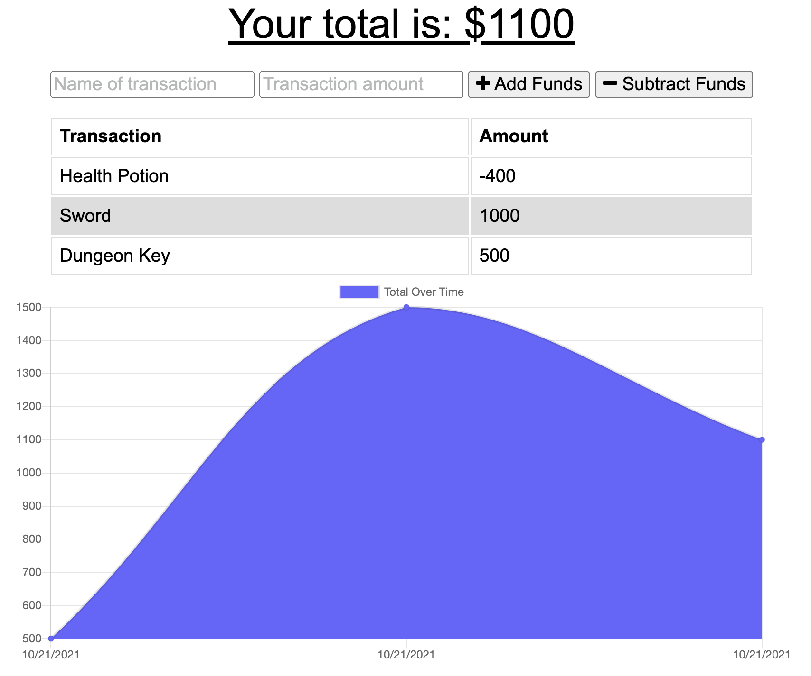
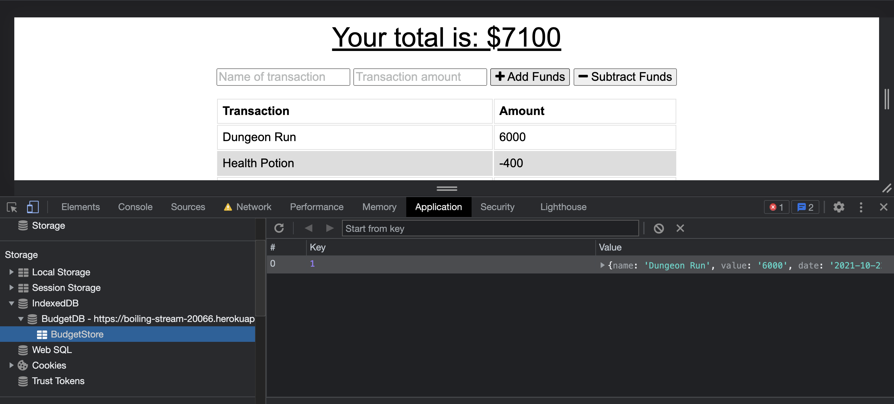

# <ins>Online Offline Budget Trackers</ins>

## <ins>Description</ins>

Giving users a fast and easy way to track their money is important, but allowing them to access that information anytime is even more important. Having offline functionality is paramount to our applications success.

## <ins>Table of Contents</ins>

- [Installation](#installation)
- [Usage](#usage)
- [License](#license)
- [Features](#features)
- [Contributions](#contributions)
- [Tests](#tests)
- [Questions](#questions)

## <ins>Installation</ins>

npm i, mongod

## <ins>Usage</ins>

AS AN avid traveller
I WANT to be able to track my withdrawals and deposits with or without a data/internet connection
SO THAT my account balance is accurate when I am traveling

### [Check out the Budget Tracker!](https://boiling-stream-20066.herokuapp.com/)

## <ins>License</ins>

This project is covered under MIT

## <ins>Features</ins>

- Add deposits

- Subtract funds

- Track your account balance

- Works without data/internet connection

## <ins>Contributions

- [xBOBOYx](https://github.com/xBOBOYx)

## <ins>Tests</ins>

no testing done

## <ins>Questions</ins>

Contact BOBOY at boboy.zamora@gmail.com. Github link: https://github.com/xBOBOYx
